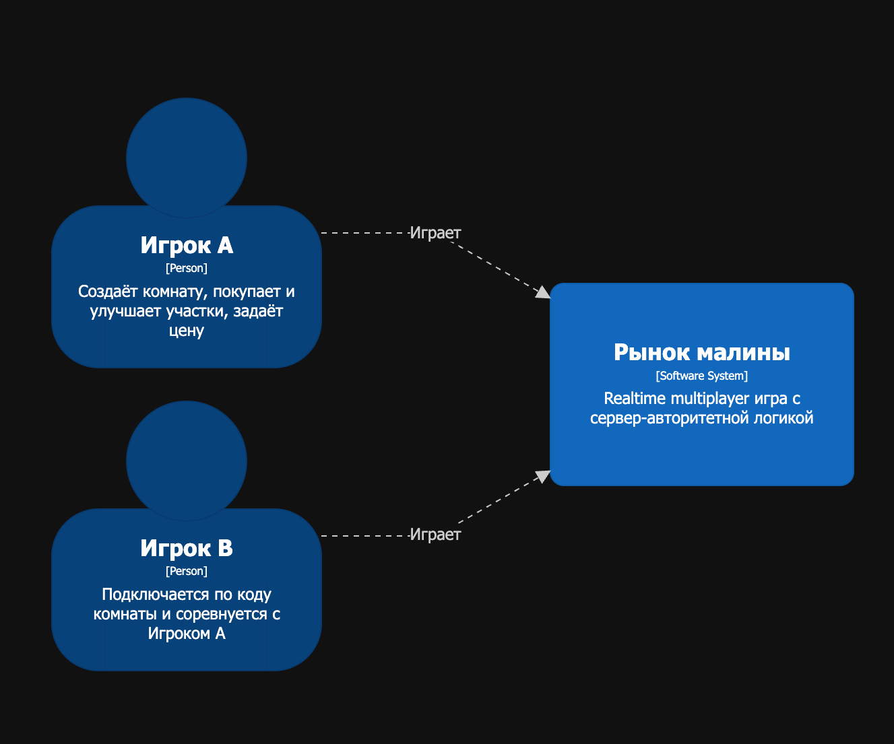
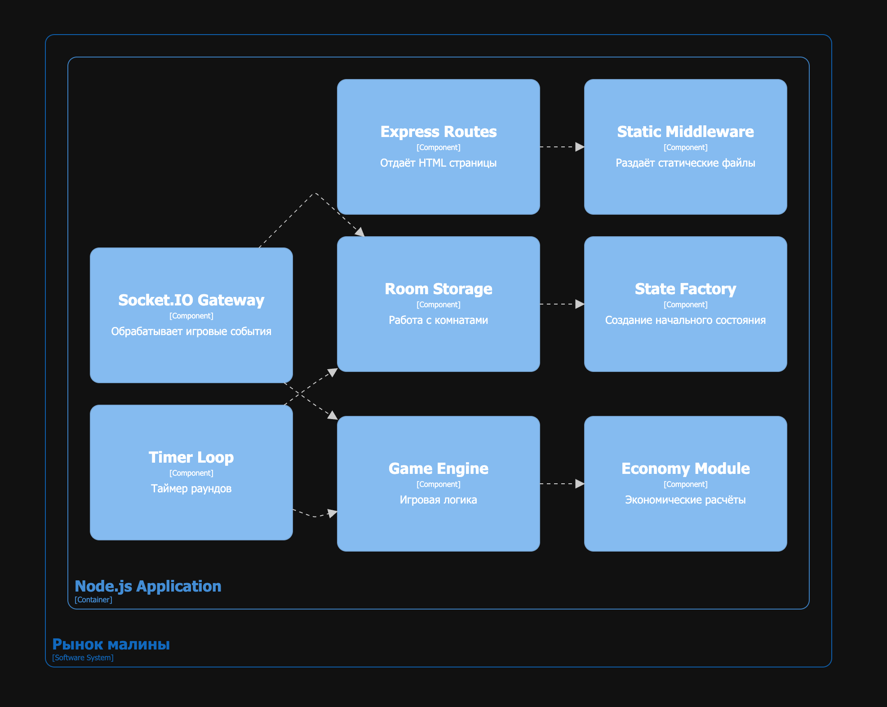
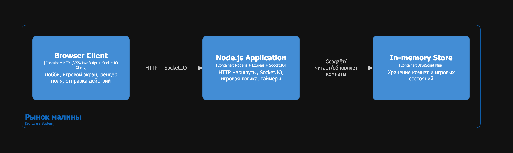

## Описание приложения для пользователя

**«Рынок малины»** — это интерактивная экономическая сайт-игра, в которой пользователь становится владельцем собственного малинового хозяйства и соревнуется с другим игроком за лидерство на рынке. Проект сочетает простые игровые действия с настоящей экономической логикой: игрок покупает землю, улучшает участки, устанавливает цену на продукцию, следит за спросом и старается заработать больше соперника. Это не просто игра на удачу — здесь побеждает тот, кто умеет думать стратегически, просчитывать решения и быстро реагировать на ситуацию на рынке.

### Начало работы с приложением

После открытия сайта пользователь попадает в **лобби**. Здесь можно создать новую игру или подключиться к уже созданной комнате по коду. Если пользователь хочет начать матч, он нажимает кнопку **«Создать игру»**, после чего получает комнату для подключения соперника. Второй игрок вводит код комнаты в соответствующую графу и нажимает **«Подключиться»**. После подключения обоих игроков матч начинается автоматически.

*Скриншот 1. Лобби игры: создание комнаты и подключение по коду.*

Игра рассчитана на формат **1 на 1**, поэтому каждый матч превращается в прямое экономическое состязание между двумя фермерами. У каждого игрока на старте есть **5 000 денежных единиц**, один начальный участок и ограниченное время на принятие решений. Один раунд длится **60 секунд**, а вся игра состоит из **10 раундов**. Побеждает игрок, у которого к концу последнего раунда окажется больший баланс.

### Игровое поле

После начала матча пользователь видит основное игровое поле — карту земельных участков. Каждый участок имеет свой коэффициент урожайности: например, **1.00**, **1.10**, **1.25**, **1.30** или **1.50**. Чем выше коэффициент, тем больше урожая может принести участок. Самые ценные земли расположены ближе к центру карты, поэтому борьба за них становится важной частью стратегии.

*Скриншот 2. Игровое поле: карта участков, баланс, цена, спрос и действия игрока.*

На поле отображаются свободные клетки, участки игрока А и участки игрока B. Чтобы не запутаться, владение участками выделяется визуально: разные игроки имеют разные обозначения. Благодаря этому пользователь сразу видит, какие земли уже заняты, где находится соперник и какие участки ещё можно купить.

### Что может делать пользователь

В каждом раунде игрок принимает несколько ключевых решений.

Во-первых, он может **покупать новые участки**. Для этого нужно выбрать свободную клетку на карте и нажать кнопку покупки. Важно, что покупать можно только соседние участки, поэтому развитие хозяйства происходит постепенно. Это делает игру стратегической: нужно заранее думать, в какую сторону расширяться и стоит ли стремиться к центру карты.

Во-вторых, пользователь может **улучшать уже купленные участки**. Улучшение повышает урожайность земли, а значит, в следующих раундах участок сможет приносить больше продукции. Это создаёт выбор: купить больше земли или вложиться в качество уже имеющихся участков.

В-третьих, игрок может **устанавливать цену продажи малины**. Цена напрямую влияет на результат: низкая цена помогает привлечь больше покупателей, а высокая цена может принести больше денег за каждый проданный килограмм. Однако слишком высокая может обернуться отсутствием спроса, поэтому игроку нужно искать баланс. 

В-четвёртых, пользователь должен **следить за спросом**. Спрос меняется по ходу игры: в одни периоды рынок активнее, в другие — слабее. Поэтому нельзя просто один раз выбрать стратегию и повторять её до конца матча. Нужно наблюдать за рынком, анализировать действия соперника и менять цену в зависимости от ситуации.

### Как проходит раунд

Каждый раунд длится 60 секунд. За это время игрок выбирает участок, покупает или улучшает землю, устанавливает цену и завершает ход. После завершения хода обоими игроками система рассчитывает урожай, спрос, продажи и изменение баланса. Затем начинается следующий раунд.

Игрок постоянно видит основные показатели: количество участков, средний коэффициент урожайности, баланс, прогноз урожая. Поэтому все важные данные находятся прямо перед глазами, и пользователю не нужно ничего искать в дополнительных меню.

### Почему игра интересна

Главное преимущество проекта — в том, что он превращает экономику в понятный и увлекательный игровой процесс. Пользователь не просто читает про спрос, цену, конкуренцию и инвестиции, а сам сталкивается с этими явлениями внутри игры. Каждое решение имеет последствия: неудачная цена может снизить продажи, медленное расширение может отдать центр карты сопернику, а чрезмерные траты на землю могут оставить игрока без денег.

«Рынок малины» выделяется тем, что он одновременно простой для входа и достаточно глубокий для стратегии. Новому пользователю не нужно долго изучать правила: достаточно создать комнату, подключить соперника и начать играть. При этом каждый матч может развиваться по-разному, потому что игроки сами выбирают стиль поведения: агрессивно скупать землю, улучшать лучшие участки, снижать цену ради спроса или делать ставку на дорогую продукцию.

### Цель пользователя

Цель игры проста и понятна: **за 10 раундов накопить больше денег, чем соперник**. Для этого нужно грамотно развивать хозяйство, выбирать выгодные участки, улучшать землю, устанавливать правильную цену и учитывать рыночный спрос. Победит не тот, кто нажимает быстрее, а тот, кто лучше понимает рынок и принимает более точные решения.


# Техническое описание реализации для разработчика

Проект «Рынок малины» - multiplayer-игра на Node.js, Express и Socket.Io с сервер-авторитетной логикой. 

## C4 System Context

Система выглядит как браузерная игра для двух игроков. Пользователь сначала попадает в лобби, создаёт комнату или вводит код комнаты, затем переходит на игровой экран. Все игровые решения принимает сервер.

В проекте нет внешней базы данных, очереди сообщений, сторонней авторизации или внешнего API. Все комнаты и состояния игр хранятся в памяти Node.js процесса.

## C4 Container 

Контейнеры здесь - это крупные исполняемые части системы: браузерный клиент, Node.js приложение и in-memory хранилище внутри процесса.

### Контейнер Browser Client

Файлы:
- `public/lobby.html`
- `public/lobby.js`
- `public/index.html`
- `public/client.js`
- `public/game-over-modal.js`

Задачи:
- показать лобби
- сохранить `roomId` и `userId` в browser storage
- подключиться к Socket.IO
- отправлять игровые действия
- рендерить действия
- показать финальную заставку

браузер не создаёт и не изменяет авторитетный game state.

### Контейнер Node.js Application

Файлы:
- `server.js`
- `game/state.js`
- `game/engine.js`
- `game/economy.js`
- `storage/memory.js`

Задачи:
- раздача статических файлов
- Socket.IO события
- создание комнат
- назначение ролей
- очередь действий
- расчёт покупок, улучшений, продаж, прибыли и победителя
- серверный таймер раундов

## C4 Component 

### Express Routes

Файл: `server.js`

Маршруты:
- `GET /` отдаёт `public/lobby.html`;
- `GET /lobby` отдаёт `public/lobby.html`;
- `GET /game` отдаёт `public/index.html`;
- `express.static(PUBLIC_DIR)` отдаёт `public/client.js`, `public/lobby.js`, `public/game-over-modal.js` и другие статические файлы.

### Socket.IO Gateway

Файл: `server.js`

События от клиента:
Событие | Что передает | Назначение
`room_create` | `{ userId? }` | Создать новую комнату
`room_join` | `{ roomId, userId? }` | Подключиться к комнате из лобби
`join` | `{ roomId, userId? }` | Войти в комнату на странице игры
`action` | `{ actionId, type, payload }` | Отправить игровое действие
`restart_game` | none | Сбросить партию в текущей комнате

События от сервера:
Событие | Что передает | Назначение
`room_created` | `{ roomId, userId, role }` | Комната создана
`room_joined` | `{ roomId, userId, role }` | Игрок вошёл 
`hello` | `{ userId, role, roomId }` | Подтверждение входа в игру 
`state_snapshot` | `{ state }` | Полный снимок состояния 
`round_tick` | `{ round, secondsLeft, roundEndsAt }` | Обновление таймера 
`round_ended` | `{ roundResult }` | Итоги раунда 
`game_over` | `{ winner, finalBalances }` | Игра завершена 
`action_rejected` | `{ actionId, code, message }` | Игровое действие отклонено 
`room_error` | `{ code, message }` | Ошибка комнаты 

## C4 Code

На уровне кода проект разделён на небольшие CommonJS-модули.

class server_js {
  +generateUserId()
  +normalizeUserId(userId)
  +normalizeRoomId(roomId)
  +createUniqueRoom()
  +assignRole(room, userId)
  +bindSocketToRoom(socket, room, userId, role)
  +maybeStartRoomGame(room)
  +restartRoomGame(room)
  +joinRoomForGame(socket, payload)
  +processActionQueue(room)
}

class memory_js {
  +createRoom(roomId)
  +getOrCreateRoom(roomId)
  +getRoom(roomId)
  +getRooms()
  +resetRooms()
}

class state_js {
  +tileBonusByDistance(x, y, width, height)
  +createInitialState(roomId)
}

class engine_js {
  +getBuyPrice(tileBonus)
  +getUpgradeCost(tile)
  +startGame(room, now)
  +applyAction(room, role, action)
  +endRound(room, now)
  +tick(room, now)
  +getPublicState(room)
}

class economy_js {
  +demandIntercept(round)
  +demandAtPrice(round, price)
  +allocateDemandByPrices(totalDemand, priceA, priceB, capacityA, capacityB)
  +settleRound(params)
}

взаимодействия:
server_js --> memory_js
server_js --> state_js
server_js --> engine_js
memory_js --> state_js
engine_js --> economy_js


### State model

Главный объект состояния находится в `room.state`.

```js
{
  roomId,
  width,
  height,
  maxRounds,
  roundSeconds,
  baseYield,
  maxPlotK,
  status,
  round,
  roundEndsAt,
  secondsLeft,
  freePlots,
  players: {
    A: {
      role,
      userId,
      balance,
      price,
      finishedRound,
      kpi: { numPlots, avgK, forecastYield }
    },
    B: { ... }
  },
  tiles: [
    { id, x, y, owner, tileBonus, k }
  ],
  marketPreview,
  lastRoundResult
}
```

### Room model

Комната оборачивает `state` и добавляет технические структуры для сервера:

```js
{
  roomId,
  state,
  processedActionIds: Set,
  actionQueue: [],
  processingQueue: false,
  connectedUsers: Map
}
```

`processedActionIds` нужен для cлучая, если клиент повторно отправит тот же `actionId`.  Сервер не применит действие второй раз.

`actionQueue` нужна для строгого порядка обработки действий в комнате. Если два игрока покупают одну клетку, победит первое действие в очереди.

## Runtime-сценарии

### Создание комнаты

  Player->>Lobby: Нажимает "Создать игру"
  Lobby->>Server: room_create { userId? }
  Server->>Server: generateRoomCode()
  Server->>Storage: createRoom(roomId)
  Storage->>State: createInitialState(roomId)
  State-->>Storage: gameState status=waiting
  Storage-->>Server: room
  Server->>Server: assignRole(room, userId) => A
  Server-->>Lobby: room_created { roomId, userId, role }
  Lobby->>Lobby: save roomId/userId
  Lobby->>Player: redirect /game


### Подключение второго игрока и старт игры

  PlayerB->>Lobby: Вводит код комнаты
  Lobby->>Server: room_join { roomId, userId? }
  Server->>Server: assignRole(room, userId) => B
  Server->>Engine: startGame(room)
  Engine-->>Server: state.status = running
  Server-->>Lobby: room_joined { roomId, userId, role }
  Server-->>Clients: state_snapshot { state }
  Server-->>Clients: round_tick { secondsLeft }


### Покупка участка

  Player->>Client: Выбирает клетку и нажимает "Купить"
  Client->>Server: action { actionId, type: BUY_PLOT, payload: { tileId } }
  Server->>Server: room.actionQueue.push(action)
  Server->>Engine: applyAction(room, role, action)
  Engine->>Room: Проверяет free, adjacent, balance
  Engine->>Room: tile.owner = role, balance -= price
  Engine-->>Server: { changed: true }
  Server-->>Client: state_snapshot { state }
  Client->>Client: render(state)


### Завершение раунда

  Timer->>Server
  Server->>Engine: tick(room, Date.now())
  Engine->>Engine: now >= roundEndsAt?
  Engine->>Economy: settleRound({ prices, production })
  Economy-->>Engine: roundResult
  Engine->>Engine: balance += profit
  Engine-->>Server: { roundEnded, roundResult, gameOver? }
  Server-->>Clients: state_snapshot
  Server-->>Clients: round_ended
  alt gameOver
    Server-->>Clients: game_over
  else next round
    Server-->>Clients: round_tick
  end


## Сервер-авторитетная логика

Клиентская сторона содержит копии некоторых формул только для подсказок UI:
- цена покупки на кнопке;
- цена улучшения на кнопке;
- доступность кнопок.

Но итоговое решение всегда принимает сервер:
- `applyAction` проверяет роль;
- проверяет статус игры;
- проверяет `actionId`;
- проверяет владельца клетки;
- проверяет соседство;
- проверяет деньги;
- меняет state;
- рассылает новый `state_snapshot`.

Это защищает проект от ситуации, когда пользователь меняет JavaScript в браузере и пытается купить недоступную клетку или получить деньги.

## Обработка ошибок

Ошибки делятся на два типа.

### Ошибки комнаты

Отправляются как `room_error`:
- `ROOM_REQUIRED`;
- `ROOM_NOT_FOUND`;
- `ROOM_FULL`;
- `INVALID_ROOM_CODE`;
- `NOT_IN_ROOM`.

Их обрабатывают `public/lobby.js` и `public/client.js`.

### Ошибки игровых действий

Отправляются как `action_rejected`:
- `NO_ROLE`;
- `GAME_NOT_RUNNING`;
- `INVALID_ACTION`;
- `INVALID_ACTION_ID`;
- `PLOT_NOT_FOUND`;
- `PLOT_OCCUPIED`;
- `NOT_ADJACENT`;
- `INSUFFICIENT_FUNDS`;
- `NOT_OWNER`;
- `K_MAXED`;
- `INVALID_PRICE`;
- `UNKNOWN_ACTION`.

Функция `applyAction` не бросает исключения для обычных игровых ошибок, а возвращает объект `rejected`. Это упрощает обработку на Socket.IO уровне.


## Основная логика

1. `lobby.js` создаёт или подключает комнату.
2. `server.js` создаёт room через `storage/memory.js`.
3. `storage/memory.js` создаёт state через `game/state.js`.
4. `client.js` отправляет игровые `action`.
5. `server.js` кладёт action в очередь.
6. `game/engine.js` валидирует и применяет action.
7. `game/economy.js` считает итоги раунда.
8. `server.js` рассылает `state_snapshot`.
9. `client.js` вызывает `render(state)`.






# Экономическая игра «Рынок малины»

**«Рынок малины»** — веб-симулятор ценовой конкуренции двух фермеров с общей картой земли.  
Каждый раунд (10 раундов, по 60 сек) фермеры одновременно:
- покупают участки на едином поле
- улучшают свои участки
- назначают цену за кг продукции

Урожай формируется из количества участков и их коэффициентов. Сбыт идёт на общий рынок по модели Бертрана: покупатели выбирают более низкую цену. При равной цене спрос делится. Спрос задан функцией  `Q_d(P) = a - bP`.

**Ключевые эффекты:** ценовые войны, ценность «премиальной» земли, выбор между ростом площади и качественным апгрейдом.

---

## Цель проекта
Показать в интерактивной форме, как ценовая конкуренция на рынке сочетается с ограничениями мощности (через землю/урожайность), и как инвестиции в ресурсную базу меняют равновесие, прибыль и стратегию.

---

## Функциональные возможности
- Онлайн дуэль: два игрока играют одновременно, таймер 60 сек на ход 
- Единое поле 5×7
- Улучшенные ячейки ближе к центру: 1.10 / 1.25 / 1.30 / 1.50; 
- Действия за ход:
  - купить свободный выделенный участок
  - улучшить свой участок  
  - назначить цену продажи урожая на раунд;  
  - пропустить ход  
- Рынок: линейный спрос `Q_d=a-bP`; делёж спроса по правилам Бертрана.  
- Разрешение конфликтов при покупке: выигрывает заявка, **раньше пришедшая** на сервер.  

---

## Игровая механика
**Раунд (60 сек):**
1. Игроки выбирают действия (купить землю/улучшить землю и цену продажи собранного урожая).  
2. Сервер проверяет условия действий (деньги, доступность клетки, предел улучшений).  
3. По таймеру или при готовности обоих — расчёт рынка:  
   - урожай `q_i = tilesOwned_i × baseYield × avg_k_i`;  
   - спрос `Q_d(P)`;  
   - если `P1<P2`: продаёт 1-й `min(q1,Q_d(P1))`, 2-й — 0;  
   - если `P2<P1`: зеркально;  
   - если `P1=P2`: делёж спроса поровну с ограничением мощностями;  
   - прибыль `π_i = sold_i × (P_i − c)`.  
4. Обновляется баланс. Следующий раунд или итог матча.
