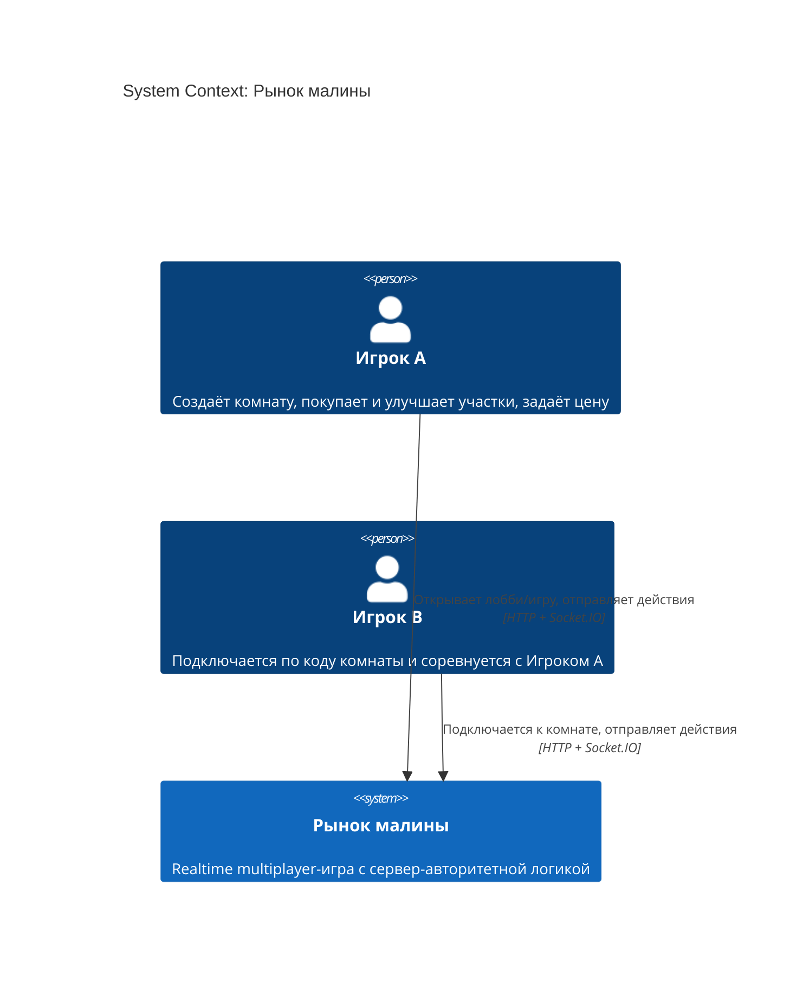
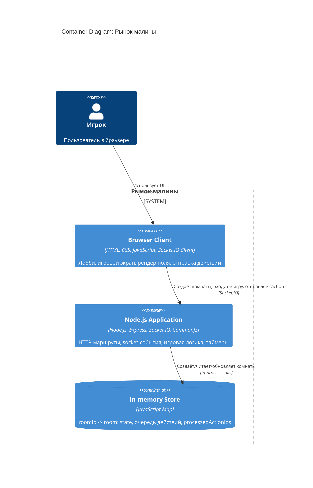
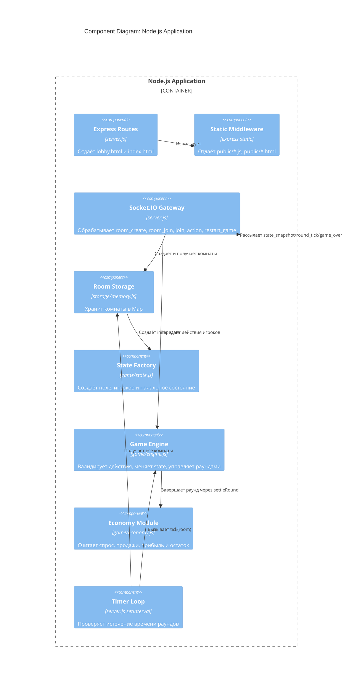
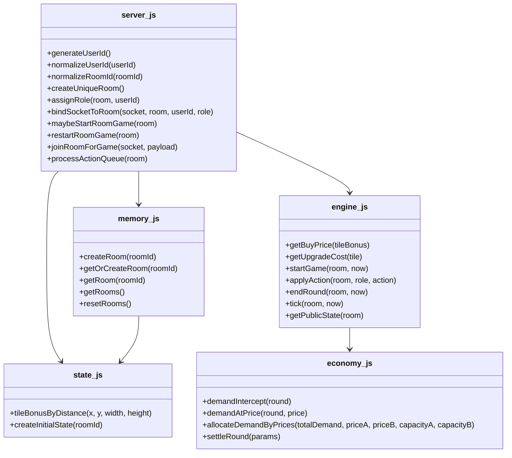
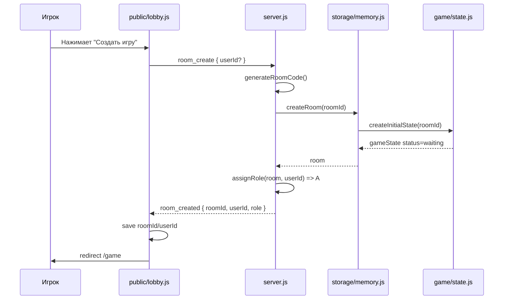
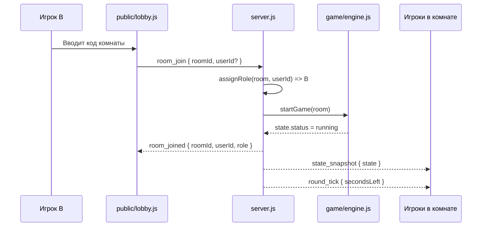
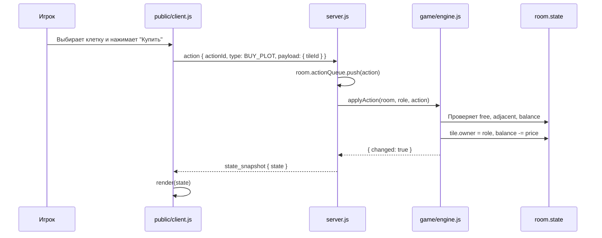
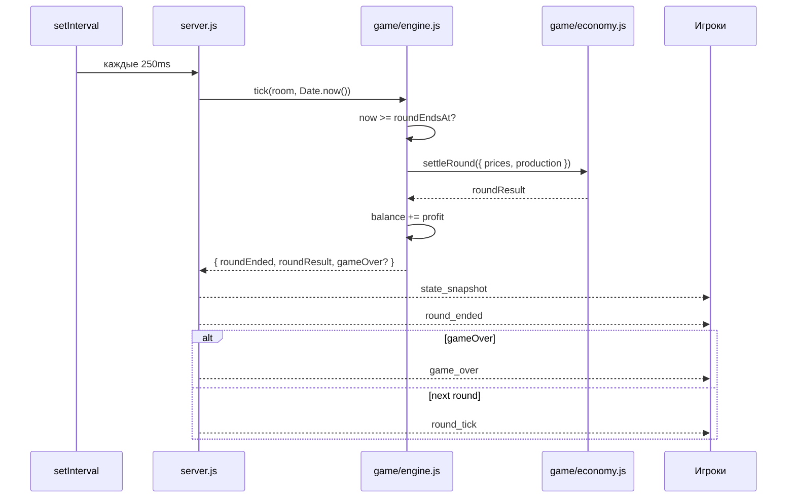

# Техническое описание реализации для разработчика

Проект «Рынок малины» — сервер-авторитетная multiplayer-игра на Node.js, Express и Socket.IO. Документ описывает архитектуру в стиле C4: от общего контекста до основных модулей кода и runtime-сценариев.

## 1. C4 Level 1: System Context

На уровне контекста система выглядит как браузерная игра для двух игроков. Пользователь сначала попадает в лобби, создаёт комнату или вводит код комнаты, затем переходит на игровой экран. Все игровые решения принимает сервер.



### Внешние зависимости

В проекте нет внешней базы данных, очереди сообщений, сторонней авторизации или внешнего API. Все комнаты и состояния игр хранятся в памяти Node.js процесса.

Ключевое следствие: после перезапуска сервера все комнаты исчезают.

## 2. C4 Level 2: Container Diagram

Контейнеры здесь — это крупные исполняемые части системы: браузерный клиент, Node.js приложение и in-memory хранилище внутри процесса.



### Контейнер Browser Client

Файлы:
- `public/lobby.html`
- `public/lobby.js`
- `public/index.html`
- `public/client.js`
- `public/game-over-modal.js`

Ответственность:
- показать лобби;
- сохранить `roomId` и `userId` в browser storage;
- подключиться к Socket.IO;
- отправлять игровые действия;
- рендерить `state_snapshot`;
- показать финальную модалку.

Ограничение: браузер не создаёт и не изменяет авторитетный game state.

### Контейнер Node.js Application

Файлы:
- `server.js`
- `game/state.js`
- `game/engine.js`
- `game/economy.js`
- `storage/memory.js`

Ответственность:
- HTTP routes: `/`, `/lobby`, `/game`;
- раздача статических файлов;
- Socket.IO events;
- создание комнат;
- назначение ролей;
- очередь действий;
- расчёт покупок, улучшений, продаж, прибыли и победителя;
- серверный таймер раундов.

### Контейнер In-memory Store

Файл:
- `storage/memory.js`

Технически это не отдельный процесс, а `Map` внутри Node.js приложения:

```js
roomId -> {
  roomId,
  state,
  processedActionIds,
  actionQueue,
  processingQueue
}
```

Такое решение подходит для MVP и локальной демонстрации, но не подходит для production без доработок.

## 3. C4 Level 3: Component Diagram

Ниже показаны основные компоненты внутри Node.js приложения.



### Express Routes

Файл: `server.js`

Маршруты:
- `GET /` отдаёт `public/lobby.html`;
- `GET /lobby` отдаёт `public/lobby.html`;
- `GET /game` отдаёт `public/index.html`;
- `express.static(PUBLIC_DIR)` отдаёт `public/client.js`, `public/lobby.js`, `public/game-over-modal.js` и другие статические файлы.

### Socket.IO Gateway

Файл: `server.js`

События от клиента:

| Event | Payload | Назначение |
|---|---|---|
| `room_create` | `{ userId? }` | Создать новую комнату |
| `room_join` | `{ roomId, userId? }` | Подключиться к комнате из лобби |
| `join` | `{ roomId, userId? }` | Войти в комнату на странице игры |
| `action` | `{ actionId, type, payload }` | Отправить игровое действие |
| `restart_game` | none | Сбросить партию в текущей комнате |

События от сервера:

| Event | Payload | Назначение |
|---|---|---|
| `room_created` | `{ roomId, userId, role }` | Комната создана |
| `room_joined` | `{ roomId, userId, role }` | Игрок вошёл |
| `hello` | `{ userId, role, roomId }` | Подтверждение входа в игру |
| `state_snapshot` | `{ state }` | Полный снимок состояния |
| `round_tick` | `{ round, secondsLeft, roundEndsAt }` | Обновление таймера |
| `round_ended` | `{ roundResult }` | Итоги раунда |
| `game_over` | `{ winner, finalBalances }` | Игра завершена |
| `action_rejected` | `{ actionId, code, message }` | Игровое действие отклонено |
| `room_error` | `{ code, message }` | Ошибка комнаты |

## 4. C4 Level 4: Code / Module View

На уровне кода проект разделён на небольшие CommonJS-модули.



### State model

Главный объект состояния находится в `room.state`.

```js
{
  roomId,
  width,
  height,
  maxRounds,
  roundSeconds,
  baseYield,
  maxPlotK,
  status,
  round,
  roundEndsAt,
  secondsLeft,
  freePlots,
  players: {
    A: {
      role,
      userId,
      balance,
      price,
      finishedRound,
      kpi: { numPlots, avgK, forecastYield }
    },
    B: { ... }
  },
  tiles: [
    { id, x, y, owner, tileBonus, k }
  ],
  marketPreview,
  lastRoundResult
}
```

### Room model

Комната оборачивает `state` и добавляет технические структуры для сервера:

```js
{
  roomId,
  state,
  processedActionIds: Set,
  actionQueue: [],
  processingQueue: false,
  connectedUsers: Map
}
```

`processedActionIds` нужен для идемпотентности. Если клиент повторно отправит тот же `actionId`, сервер не применит действие второй раз.

`actionQueue` нужна для строгого порядка обработки действий в комнате. Если два игрока покупают одну клетку, победит первое действие в очереди.

## 5. Runtime-сценарии

### 5.1 Создание комнаты



### 5.2 Подключение второго игрока и старт игры



### 5.3 Покупка участка



### 5.4 Завершение раунда



## 6. Сервер-авторитетная логика

Клиентская сторона содержит копии некоторых формул только для подсказок UI:
- цена покупки на кнопке;
- цена улучшения на кнопке;
- доступность кнопок.

Но итоговое решение всегда принимает сервер:
- `applyAction` проверяет роль;
- проверяет статус игры;
- проверяет `actionId`;
- проверяет владельца клетки;
- проверяет соседство;
- проверяет деньги;
- меняет state;
- рассылает новый `state_snapshot`.

Это защищает проект от ситуации, когда пользователь меняет JavaScript в браузере и пытается купить недоступную клетку или получить деньги.

## 7. Обработка ошибок

Ошибки делятся на два типа.

### Ошибки комнаты

Отправляются как `room_error`:
- `ROOM_REQUIRED`;
- `ROOM_NOT_FOUND`;
- `ROOM_FULL`;
- `INVALID_ROOM_CODE`;
- `NOT_IN_ROOM`.

Их обрабатывают `public/lobby.js` и `public/client.js`.

### Ошибки игровых действий

Отправляются как `action_rejected`:
- `NO_ROLE`;
- `GAME_NOT_RUNNING`;
- `INVALID_ACTION`;
- `INVALID_ACTION_ID`;
- `PLOT_NOT_FOUND`;
- `PLOT_OCCUPIED`;
- `NOT_ADJACENT`;
- `INSUFFICIENT_FUNDS`;
- `NOT_OWNER`;
- `K_MAXED`;
- `INVALID_PRICE`;
- `UNKNOWN_ACTION`.

Функция `applyAction` не бросает исключения для обычных игровых ошибок, а возвращает объект `rejected`. Это упрощает обработку на Socket.IO уровне.

## 8. Тестирование

Тесты находятся в `test/*.test.js` и запускаются командой:

```bash
npm test
```

Покрытые правила:
- конфликт покупки одной клетки решается первым обработанным действием;
- апгрейд не превышает `1.50`;
- стартовая цена равна `100`;
- дробная цена отклоняется;
- при равных ценах продажи ограничены урожаем;
- остаток спроса переходит второму игроку;
- спрос фиксирован по раундам и не зависит от цены.

## 9. Ограничения текущей реализации

Технические ограничения MVP:
- нет постоянной базы данных;
- нет настоящей авторизации;
- `userId` можно подменить в browser storage;
- комнаты не очищаются автоматически по TTL;
- нет горизонтального масштабирования, потому что state находится в памяти одного процесса;
- нет e2e-тестов браузерного сценария;
- frontend не собран через bundler, а подключается обычными script-тегами.

Что можно улучшить:
- заменить `storage/memory.js` на PostgreSQL/Redis;
- добавить JWT/session-auth;
- добавить TTL для комнат;
- добавить Playwright e2e-тесты;
- вынести CSS в отдельные файлы;
- добавить rate limiting для Socket.IO событий.

## 10. Что важно понимать разработчику

Главный поток проекта:

1. `lobby.js` создаёт или подключает комнату.
2. `server.js` создаёт room через `storage/memory.js`.
3. `storage/memory.js` создаёт state через `game/state.js`.
4. `client.js` отправляет игровые `action`.
5. `server.js` кладёт action в очередь.
6. `game/engine.js` валидирует и применяет action.
7. `game/economy.js` считает итоги раунда.
8. `server.js` рассылает `state_snapshot`.
9. `client.js` вызывает `render(state)`.

Ключевая мысль для поддержки проекта: любое изменение игровых правил должно начинаться с серверных модулей `game/engine.js` и `game/economy.js`, а frontend должен только отображать результат.
